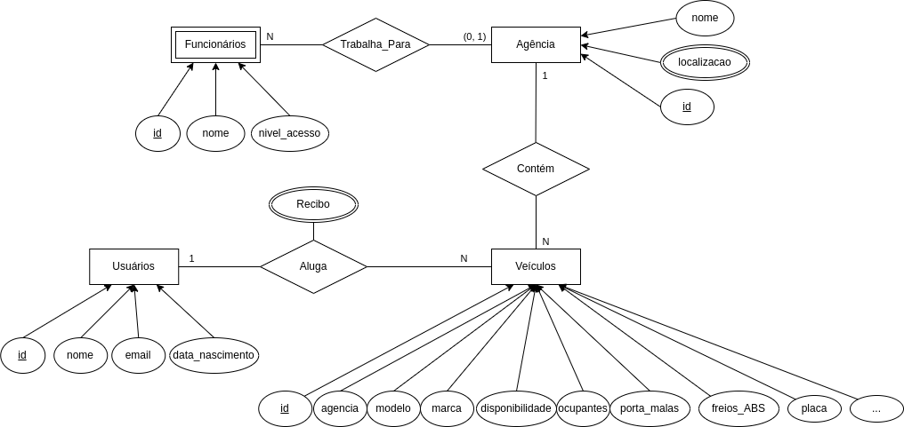

# Documentação

# Equipe:
* Alisson Augusto
* Guilherme Saraiva
* Paulo Nelson
* Vitor Ipiranga

# Requisitos
## Requisitos Funcionais
* RF001: O sistema deve permitir que os usuários criem uma conta e façam login.
* RF002: O sistema deve mostrar os modelos de veículos disponíveis nas agências selecionadas no momento da reserva.
* RF003: O sistema deve permitir que os usuários reservem um veículo selecionado, fornecendo informações de local de retirada e devolução.
* RF004: O sistema deve gerar um recibo eletrônico da reserva e armazená-lo na base de dados.
* RF005: O sistema deve permitir aos usuários visualizar toda a frota de modelos de carros disponíveis.
* RF006: O sistema deve permitir aos usuários logados visualizar seu histórico de reservas.
* RF007: O sistema deve permitir aos usuários pesquisarem por agências.

## Requisitos não funcionais
* RNF001: O sistema deve ser compatível com os principais navegadores da web (Chrome, Firefox, Safari e Edge).
* RNF002: O tempo de resposta do sistema não deve exceder 2 segundos para qualquer solicitação.
* RNF003: O sistema deve seguir padrões de segurança para proteger informações sensíveis dos clientes, como criptografia para dados sensíveis.
* RNF004: O sistema deve ser capaz de gerenciar seu próprio inventário e reservas.
* RNF005: O sistema deve ser escalável para acomodar um aumento na demanda durante períodos de pico.

# Modelo de Entidade e Relacionamento (MER)


# Relatório
## Requisito 1: O sistema deve permitir que os usuários criem uma conta e façam login.

## Implementação do Requisito:
Foi criado duas rotas `/login` e `/cadastro` definidos no arquivo `app/autenticacao.py`.

Na rota `/login`: Página renderiza formulário de login para usuário e permite autenticação, caso usuário informe as credenciais correspondentes as fornecidas durante preenchimento do formulário da rota de `/cadastro`.

A rota de login é definida no arquivo `app/autenticacao.py`
```py
@auth.route("/login", methods=["GET", "POST"])
def login():
    form = LoginForm()
    if form.validate_on_submit():
        email = form.email.data
        usuario:Usuario = Usuario.query.filter_by(email=email).first()
        if usuario and usuario.verificar_senha(form.senha.data):
            login_user(usuario)
            return redirect("/")
        flash("Email ou senha incorreto")

    return render_template("auth/login.html", form=form)
```

Rota de Cadastro também é definida no mesmo arquivo
```py
@auth.route("/cadastro", methods=["GET", "POST"])
def cadastro():
    form = CadastroForm()
    if form.validate_on_submit():
        email = form.email.data
        usuario:Usuario = Usuario.query.filter_by(email=email).first()
        if not usuario:
            # Registra usuário no banco
            user = Usuario(
                nome=form.nome.data,
                email=email,
                senha=form.senha.data,
                data_nascimento=form.data_nascimento.data
                )
            db.session.add(user)
            db.session.commit()
            login_user(user)
            return redirect("/")
        
        flash("Este usuário já foi cadastrado")
    return render_template("auth/cadastro.html", form=form)
```

Tanto o login quanto cadastro possuem classes `LoginForm` e `CadastroForm`, nas quais são implementadas as validações do "lado do servidor" por meio da biblioteca Flask-WTF por meio dos arquivos `app/forms/login.py` e `app/forms/cadastro.py`, para garantir que as informações de cadastro não são nulas.


classes LoginForm e CadastroForm
```py
class LoginForm(FlaskForm):
    email = EmailField("email", validators=[InputRequired()])
    senha = PasswordField("senha", validators=[InputRequired()])

class CadastroForm(FlaskForm):
    nome = StringField('nome', validators=[InputRequired()])
    email = EmailField("email", validators=[InputRequired()])
    senha = PasswordField("senha", validators=[InputRequired()])
    data_nascimento = DateField("data_nascimento", validators= InputRequired()])
```

## Teste do Requisito:
O Arquivo `tests/test_requisito_1.py` garante que este requisito esta funcionando corretamente, por meio da definição

```py
@pytest.fixture
def client():
  app = create_app("test")

  # Remove todos os dados anteriores
  with app.app_context():
    db.drop_all()
    db.create_all()
  
  with app.test_client() as client:
    yield client
  
  # Remove todos os dados inseridos após os testes
  with app.app_context():
    db.drop_all()
```

É declarado para create_app utilizar a configuração de teste, isso implica que, o banco utilizado será o de teste, portanto. Não impactará os bancos de Produção e Desenvolvimento.

Para garantir que o requisito 1 seja atendido, é definido a seguinte função de teste

```py
def test_cadastro_e_login_usuario(client):
  response = client.post("/cadastro", data={
        "nome" : "TestUser",
        "email": "test@exemplo.com",
        "senha": "TestSenha",
        "data_nascimento": "2001-05-19"
    })

  # Valida se o código de status da requisição é de redirect 302
  # Indicando que usuário foi cadastrado com sucesso e
  # foi direcionado para a página inicial "/"
  assert response.status_code == 302

  # Testa Login, com o novo usuário registrado
  response = client.post("/login", data={
        "email": "test@exemplo.com",
        "senha": "TestSenha",
    })

  assert response.status_code == 302
```

## Reserva de veículos, requisitos: 2, 3, 4, 5 e 6

## Implementação do Requisito:
As definições para esse requisito são implementadas nas rotas `/agencias/<id>` e `/agencias/veiculo/<modelo>` no arquivo `app/routes.py`, que permitem os usuários realizar a reserva dos veículos, por meio de um formulário. Tanto selecionando por uma agência especifica quanto buscando por um modelo de veículo.

Código para reservar usando agência específica
```py
@rotas.route("/agencias/<id>", methods=["GET", "POST"])
@login_required
def agencias(id):
  form = ReservaForm()
  agencia_selecionada = Agencia.query.get(id)
  agencias = Agencia.query.all()
  veiculos = Veiculos.get_from_agencia(id)
  form.ag_retirada.choices = [(id, agencia_selecionada.localizacao)]
  form.ag_devolucao.choices = [(agencia.id, agencia.localizacao) for agencia in agencias]
  form.veiculo.choices = [(veiculo.id, veiculo.get_nome()) for veiculo in veiculos]

  if form.validate_on_submit():
    # Realiza locação de veículo
    veiculo = form.veiculo.data
    dt_retirada = form.data_retirada.data
    dt_devolucao = form.data_devolucao.data

    recibo = Recibo(usuario=current_user.id,
                    veiculo=veiculo,
                    data_retirada=dt_retirada,
                    data_devolucao=dt_devolucao)
    
    db.session.add(recibo)
    # Remove virtualmente o veículo
    Veiculos.query.get(veiculo).disponibilidade = False  
    db.session.commit()
    return redirect("/")


  return render_template("agencia/agencia.html",
              form=form,
              data_atual=date.today())
```

Como pode-se observar utiliza-se o método `Veiculos.get_from_agencia(id)` no qual é responsável pela busca de veículos disponíveis na agência selecionada para retirada, bem como valida se os veículos estão disponíveis para locação.

```py
@staticmethod
def get_from_agencia(id):
    veiculos = Veiculos.query.filter(Veiculos.agencia==id, Veiculos.disponibilidade==True).all()
    return Veiculos.__filtra_por_modelos(veiculos)
```

Após a geração do recibo, esse registro deve ser exibio na rota `/conta`, mostrando ao usuário logado suas reservas realizadas (Requisito 6).
```py
@rotas.route("/conta")
@login_required
def perfil():
  recibos = current_user.get_historico_locacoes()
  return render_template("home/perfil.html", recibos=recibos)
```

## Teste do Requisito:
O teste para garantir a exibição correta dos veículos é encontrado em `test_locacao.py` por meio da função de teste `test_escolha_veiculos(app: Flask)`, de forma resumida, são criadas 5 agências fictícias para realizar os testes e então é validado se na página de realizar locação `/agencias/<id agência de teste>` as informações retornadas contém todos os veículos disponíveis para a agência. 

```py
def test_escolha_veiculos(app: Flask):
  '''
    Testa se a exibição dos veículos dada uma agência, 
    esta correta, de forma que apenas veículos disponíveis e atualmente na agência sejam visíveis.
  '''
  agencia = Agencia.query.first()

  with app.test_client() as client:
    response = client.get(f"/agencias/{agencia.id}")
    assert response.status_code == 200
    assert all([veiculo.get_nome() in str(response.data) for veiculo in agencia.veiculos])
```

O teste para verificar a geração do recibo é realizado no mesmo arquivo, por meio da função `test_gerar_recibo(app: Flask)`, no qual é enviado a requisição post, conforme esperado pela rota `/agencias/<id>` e por fim, é validado se o recibo foi registrado na base de dados.

Além de validar a geração do recibo, é feita a verificação se as informações de locação estão sendo exibidas corretamente no perfil do usuário na rota `/conta`.
```py
def test_gerar_recibo_e_perfil_do_usuario(app: Flask):
  '''
    Testa se o recibo esta sendo gerado corretamente,
    de acordo com as informações respondidas no formulário
    de locação. Também valida se na rota "/conta" as informações sobre
    o veículo reservado, esta sendo exibido corretamente.
  '''

  ag_retirada = Agencia.query.first()
  veiculo = ag_retirada.veiculos[0]
  data_retirada  = "2023-05-19"
  data_devolucao = "2023-05-21"
  with app.test_client() as client:
    response = client.post(f"/agencias/{ag_retirada.id}", data={
          "ag_retirada" : ag_retirada.id,
          "data_retirada": data_retirada,
          "ag_devolucao": ag_retirada.id,
          "data_devolucao": data_devolucao,
          "veiculo": veiculo.id
      })

    # Valida se a requisição enviou código de status de redirect (302)
    # Indicando que formulário foi processado com sucesso
    # e usuário retornou para página inicial "/"
    assert response.status_code == 302

    # Verifica se o recibo foi registrado
    assert len(Recibo.query.filter(Recibo.veiculo==veiculo.id).all()) == 1

    # Verfica se reserva esta sendo exibido no perfil do usuário
    response = client.get("/conta")
    assert veiculo.get_nome() in str(response.data)
```